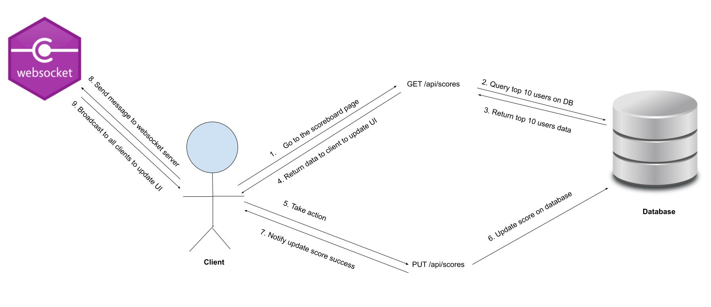

# Scoreboard API Module

## Overview

The `Scoreboard API Module` is a backend application responsible for managing and updating the top 10 users' scores in real-time. This module ensures secure score updates while providing live scoreboard updates to the front end.

---

## Features
1. **Live Scoreboard Updates:**
- Real-time broadcasting of the score update to all connected clients.

2. **Score Update API:**
- An endpoint for securely updating user scores.

- Integration with authentication and authorization mechanisms to prevent unauthorized access.

3. **Malicious Activity Prevention:**
- Only allow log-in user to update their own score based on action performed.

- Protection against spamming request.

## Flow of execution



---

## Endpoints

### 1. Update Score

**Method:**  `PUT`

**Endpoint:**  `/api/scores`

**Request Headers:**
- `Authorization: Bearer <token>` (User authentication token)

**Request Body:**

```json
{
  "action": <some_action>
}
```
**Response:**
- **200 OK**

```json
{
  "message": "Score updated successfully",
  "currentScore": <updated_score>
}
```

- **400 Bad Request**

```json
{
  "error": "Invalid input or action invalid"
}
```

- **401 Unauthorized**

```json
{
  "error": "Invalid or missing token"
}
```
- **500 Internal Server Error**

```json
{
  "error": "Error update score on DB"
}
```
### 2. Get Top Scores

**Method:**  `GET`

**Endpoint:**  `/api/scores`

**Response:**
- **200 OK**

```json
{
  "users": [
    { "userId": "<user_id>", "score": <score> },
    ...
  ]
}
```
- **500 Internal Server Error**

```json
{
  "error": "Error get top 10 user's scores on DB"
}
```

### 3. Login

**Method:**  `POST`

**Endpoint:**  `/api/login`

**Request Body:**

```json
{
  "email": <email>,
  "password": <password>
}
```
**Response:**
- **200 OK**

```json
{
  "jwtToken": <token used for authentication>,
  "email": <email>,
  "username": <username>,
}
```
- **401 Unauthorized**

```json
{
  "error": "Email or password incorrect"
}
```
- **500 Internal Server Error**

```json
{
  "error": "Error when trying to check on DB"
}
```

---

## Security Measures
1. **Authentication and Authorization:**
- Use JWT for user authentication.

2. **Input Validation:**
- Validate the input value to make sure request body is valid.

3. **Rate Limiting:**
- Apply rate limiting to the `update` endpoint to prevent spamming.

4. **Cheating Score Prevention:**
- Since the score is increased based on some specific action, log-in user can perform that action and update their own score based on the action. 
- Check if the action is valid. The valid action is something like this:
```json
{
  "type": <depend on which type of action, for example if action is answering questions>,
  "question_answers": [
    {
      "question_id": <id of question>,
      "answer": <answer of the user>
    }
    ...
  ]
}
```
---

## Database Schema
**Table: Scores** 

| Column Name | Data Type | Description |
| --- | --- | --- |
| userId | UUID | Foreign key refer to the user |
| score | INT | Current score of the user |
| updatedAt | DATETIME | Timestamp of the last update |

**Table: Users**

| Column Name     | Data Type | Description                    |
|-----------------|-----------|--------------------------------|
| ID              | UUID      | Unique identifier for the user |
| email           | TEXT      | Email of the user              |
| created_at      | DATETIME  | Timestamp of the registration  |
| hashed_password | TEXT      | Hashed password of the user    |

**Table: Questions**

| Column Name | Data Type | Description                        |
|-------------|-----------|------------------------------------|
| ID          | UUID      | Unique identifier for the question |
| content     | TEXT      | Content of the question            |
| answer      | TEXT      | Content of the answer              |


---

## Improvements
1. **Enhance cheating prevention:**
- Add an API like POST /api/generate_questions to randomly assign questions to a specific user, save these random questions on a table database like this:

| Column Name  | Data Type | Description                      |
|--------------|-----------|----------------------------------|
| ID           | UUID      | Unique identifier for the answer |
| question_ids | TEXT[]    | List of questions for this round |
| user_id      | TEXT      | Foreign key refer to user table  |
| created_at   | DATETIME  | Timestamp of this round          |
| score        | INTEGER   | Score of this round              |
- If user calls an API action without assigning questions before, return error, else check the action to verify whether the user is answering the questions.

